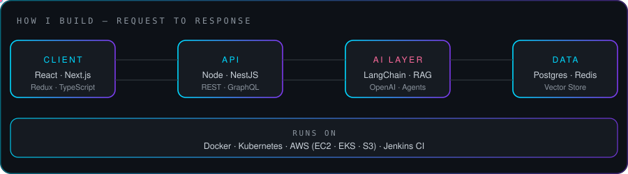

 

### About

I build full-stack products end to end — React/Next.js on the front, Node/NestJS and Postgres behind it, Docker and AWS underneath — and I'm increasingly the person who wires LLMs into those products.

Most recently at **CallerDesk (Deskotel Solutions)** I worked on the dashboard layer of an AI call-sentiment system: Whisper transcriptions of Hindi/English voice calls, 200-300 calls a day, turned into something a sales manager can actually read.

Before that, at **Datronix Digital**, I shipped OpenAI-powered features — a support chatbot, an internal assistant and a content-generation flow.

Right now: going deep on RAG and agentic systems, shipping portfolio projects as I go.

 

---

---

### AI / ML

Shipped work and study work, listed separately — no blurring the line.

<table>
<tr>
<td width="33%" valign="top">

**Shipped in production**

- OpenAI API in real product flows
- Support chatbot + internal assistant
- Content generation pipeline
- Whisper output → sentiment dashboard, ~200-300 calls/day

</td>
<td width="33%" valign="top">

**Working knowledge**

`NumPy` `Pandas` `Matplotlib`
`scikit-learn` `Statistics`
`Feature Engineering`
`Deep Learning fundamentals`
`LangChain` `Prompt Engineering`
`Embeddings & Vector DBs`
`Pydantic`

</td>
<td width="33%" valign="top">

**Going deep right now**

`RAG` — chunking, retrieval, reranking, eval
`LangGraph` — multi-agent orchestration
`Transformers / Hugging Face`
`NLP` · `MCP`
`LLM app deployment`

</td>
</tr>
</table>

---

### Stack

<b>Frontend</b>

 

<b>Backend & APIs</b>

 

<b>Data</b>

 

<b>Infra & Tooling</b>

 

  
AWS in practice: EC2, EKS, S3.

---

### Experience

| Role | Company | Period |
|:--|:--|:--|
| Software Engineer | **Deskotel Solutions — CallerDesk**, Noida | Apr 2026 - Sep 2026 |
| Full-Stack Developer | **Freelance** | 2025 - 2026 |
| Software Developer | **Datronix Digital** | 2024 - 2025 |
| Software Engineer | **LTIMindtree** | 2022 - 2023 |

---

### Featured Work

| Project | What it is | Stack |
|:--|:--|:--|
| **InsightCore** | Analytics platform — dashboards, role-based access, API layer | React, Node, PostgreSQL |
| **AI Call Sentiment Dashboard** | Sentiment view over transcribed voice calls at production volume | React, Node, Whisper output |
| **Business Management System** | Sales + inventory desktop app with reporting | Python, SQLite, Pandas |
| **NLP Application** | Desktop NLP toolkit with full auth flow | Python, Tkinter |

<a href="https://github.com/sandeepanshu?tab=repositories"><b>Browse all repositories →</b></a>

---

---

<b>How I work</b>

 

**Write it down.** Clear requirements and written specs beat hallway decisions.

**Ship small, ship often.** A working slice in production teaches more than a perfect plan.

**Own the whole path.** UI, API, schema, deploy — rather than handing off at the boundary.

**Learn in public.** Every project I finish goes up, rough edges included.

 

**Open to AI-augmented full-stack roles and collaborations — LLM features, RAG systems, production builds.**

