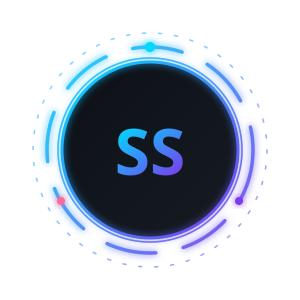

**3+ years shipping production web apps for BFSI & SaaS — now building the AI layer on top of them.**

---

## About

I build full-stack products end to end — React/Next.js on the front, Node/NestJS and Postgres behind it, Docker and AWS underneath — and I'm increasingly the person who wires LLMs into those products.

Most recently at **CallerDesk (Deskotel Solutions)** I worked on the dashboard layer of an AI call-sentiment system: Whisper transcriptions of Hindi/English voice calls, 200-300 calls a day, turned into something a sales manager can actually read. Before that, at **Datronix Digital**, I shipped OpenAI-powered features — a customer-support chatbot, an internal assistant and a content-generation flow.

Right now I'm going deep on RAG and agentic systems (LangChain / LangGraph) and shipping portfolio projects as I go.

| | |
|:--|:--|
| **Working on** | RAG pipelines + agentic workflows with LangGraph |
| **Learning** | Transformers, Hugging Face, production LLM evaluation |
| **Open to** | AI-augmented full-stack roles (React/Node + LLM) across India |
| **Ask me about** | React performance, Node APIs at scale, wiring LLMs into real apps |
| **Reach me** | sandeepks9199@gmail.com |

---

## AI / ML

Shipped work and study work listed separately.

**Shipped in production**

- OpenAI API integrations — support chatbot, internal assistant, content generation
- Whisper transcription output (Hindi + English) surfaced as a sentiment dashboard at ~200-300 calls/day
- Prompt design and response handling inside real product flows, not notebooks

**Working knowledge**

`NumPy` `Pandas` `Matplotlib` `scikit-learn` `Statistics & Probability` `Feature Engineering` `Deep Learning fundamentals` `LangChain` `Embeddings & Vector DBs` `Prompt Engineering` `Pydantic`

**Going deep right now**

`RAG (chunking, retrieval, reranking, eval)` `LangGraph & multi-agent orchestration` `Transformers / Hugging Face` `NLP` `MCP` `LLM app deployment`

---

## Engineering Stack

**Frontend**

**Backend & APIs**

**Data**

**Infra & Tooling**

> AWS in practice: EC2, EKS, S3.

---

## Experience

| Role | Company | Period |
|:--|:--|:--|
| Software Engineer | **Deskotel Solutions — CallerDesk**, Noida | Apr 2026 - Sep 2026 |
| Full-Stack Developer | **Freelance** | 2025 - 2026 |
| Software Developer | **Datronix Digital** | 2024 - 2025 |
| Software Engineer | **LTIMindtree** | 2022 - 2023 |

---

## Featured Work

| Project | What it is | Stack |
|:--|:--|:--|
| **InsightCore** | Analytics & insights platform — dashboards, role-based access, API layer | React, Node, PostgreSQL |
| **AI Call Sentiment Dashboard** | Sentiment view over transcribed voice calls at production volume | React, Node, Whisper output |
| **Business Management System** | Sales + inventory desktop app with reporting | Python, SQLite, Pandas, GUI |
| **NLP Application** | Desktop NLP toolkit with full auth flow | Python, Tkinter |

<a href="https://github.com/sandeepanshu?tab=repositories"><b>Browse all repositories</b></a>

---

## GitHub

---

## How I Work

- **Write it down.** Clear requirements and written specs beat hallway decisions.
- **Ship small, ship often.** A working slice in production teaches more than a perfect plan.
- **Own the whole path.** UI, API, schema, deploy — rather than handing off at the boundary.
- **Learn in public.** Every project I finish goes up, rough edges included.

---

**Open to collaborating on AI-augmented products — full-stack builds, LLM features, RAG systems.**

