 

### About

I'm a full-stack engineer who ships. React and Next.js on the front, Node/NestJS and Postgres behind it, Docker and AWS underneath — four years of it in BFSI and SaaS, where the question is never "does the demo work" but "does it hold up on Monday morning at volume."

The last stretch has taken me in a specific direction: putting LLMs inside products that already have real users. That's a different problem from a notebook demo — you're dealing with latency budgets, bad transcripts, cost per call and a user who won't forgive a hallucination.

At **CallerDesk** I owned the dashboard layer of an AI call-sentiment system. Whisper transcriptions of Hindi/English sales calls, 200-300 a day, turned into a view a manager reads in ten seconds instead of scrubbing through recordings.

At **Datronix Digital** I shipped three OpenAI-powered features into a live product — a support chatbot, an internal assistant, and a content generation flow.

Right now I'm going deep on retrieval quality, evaluation and agent orchestration, and shipping a project at the end of each phase rather than collecting certificates.

 

---

---

---

### Stack

**Frontend**

**Backend & APIs**

**Data**

**Infra & Tooling**

AWS in practice: EC2, EKS, S3.

---

### Experience

<table>
<tr><th align="left">Period</th><th align="left">Role & Company</th><th align="left">What I worked on</th></tr>
<tr>
<td valign="top"><b>Apr 2026 – Sep 2026</b></td>
<td valign="top"><b>Software Engineer</b> Deskotel Solutions — CallerDesk, Noida</td>
<td valign="top">Dashboard layer for an AI call-sentiment system running on live voice data. React + Node against a transcription pipeline handling 200-300 calls a day.</td>
</tr>
<tr>
<td valign="top"><b>2025 – 2026</b></td>
<td valign="top"><b>Full-Stack Developer</b> Freelance</td>
<td valign="top">End-to-end product builds for small teams — requirements to deployment, React/Node with the infra work included.</td>
</tr>
<tr>
<td valign="top"><b>2024 – 2025</b></td>
<td valign="top"><b>Software Developer</b> Datronix Digital</td>
<td valign="top">First LLM work in production: OpenAI-powered support chatbot, internal assistant and content generation, alongside core full-stack delivery.</td>
</tr>
<tr>
<td valign="top"><b>2022 – 2023</b></td>
<td valign="top"><b>Software Engineer</b> LTIMindtree</td>
<td valign="top">BFSI applications at enterprise scale — spec-driven delivery, code review culture, React front-ends against large backend systems.</td>
</tr>
</table>

---

### Featured Work

| Project | What it is | Stack |
|:--|:--|:--|
| **InsightCore** | Analytics platform — dashboards, role-based access, API layer | React, Node, PostgreSQL |
| **AI Call Sentiment Dashboard** | Sentiment view over transcribed voice calls at production volume | React, Node, Whisper output |
| **Business Management System** | Sales + inventory desktop app with reporting | Python, SQLite, Pandas |
| **NLP Application** | Desktop NLP toolkit with full auth flow | Python, Tkinter |

<a href="https://github.com/sandeepanshu?tab=repositories"><b>Browse all repositories →</b></a>

---

### GitHub

  

---

### How I Work

**Write it down.** Clear requirements and written specs beat hallway decisions. My best work has come out of teams that document.

**Ship small, ship often.** A working slice in production teaches more than a perfect plan on a whiteboard.

**Own the whole path.** UI, API, schema, deploy — I'd rather understand the full route than hand off at the boundary.

**Learn in public.** Every project I finish goes up, rough edges included.

---

**Open to AI-augmented full-stack roles and collaborations — LLM features, RAG systems, production builds.**

